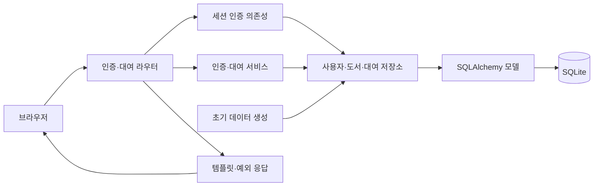

# 도서 대여 관리 서비스

## 프로젝트 소개

FastAPI, SQLAlchemy, Jinja2로 만든 세션 기반 도서 대여 웹 서비스입니다. 회원가입·로그인 후 도서를 등록하고 대여·반납하며 관계형 기록을 조회합니다.

## 핵심 특징

- 회원가입과 PBKDF2 비밀번호 해시 검증
- 로그인 사용자만 접근하는 대여 관리 화면
- 사용자·도서·대여 기록의 ORM 연관관계
- 도서 검색, 대여 상태 필터, 대여·반납 상태 전환
- 전역 예외 처리와 pytest의 인증·대여·반납 흐름 검증

## 아키텍처

`라우터 → 인증 의존성·서비스 → 저장소 → ORM → SQLite` 흐름입니다. `Loan`이 사용자와 도서를 연결하고 대여 상태·시각을 보관합니다.

| 경로 | 역할 |
| --- | --- |
| `src/library_service/main.py` | 앱 생성과 라우터·예외 처리 등록 |
| `src/library_service/bootstrap.py`, `src/library_service/core/` | 초기 데이터 생성·DB 연결·파일 경로 |
| `src/library_service/auth/` | 세션 사용자 조회와 보호 경로 의존성 |
| `src/library_service/routers/` | 인증 폼과 대여 화면 요청 |
| `src/library_service/services/` | 인증·대여 검증과 상태 변경 |
| `src/library_service/repositories/`, `src/library_service/models/` | DB 접근과 관계 매핑 |
| `src/library_service/ui/templates/`, `src/library_service/ui/static/` | 서버 렌더링 화면과 CSS |
| `tests/test_http.py`, `tests/conftest.py` | pytest HTTP 흐름·임시 DB fixture |



소스는 `src/library_service/`, 회귀 테스트는 `tests/`, 개발 보조 도구는 `scripts/`에 둡니다. `pyproject.toml`이 패키지·명령·개발 도구를 선언하고 `uv.lock`이 설치 버전을 고정합니다. `uv sync --frozen`은 소스를 개발 모드로 설치하므로 앱 실행과 테스트에 별도 `PYTHONPATH` 설정이 필요하지 않습니다.

## 실행 환경과 시작하기

Python 3.10 이상과 uv가 필요합니다. 저장소 루트에서 실행합니다.

```bash
uv sync --frozen
cp .env.example .env
# .env의 SESSION_SECRET_KEY를 자신만의 값으로 변경합니다.
set -a
. ./.env
set +a
uv run --frozen uvicorn library_service.main:app --host 127.0.0.1 --port 8000
```

기본 접속 주소는 `http://127.0.0.1:8000`입니다. 앱은 `.env`를 자동 로드하지 않으므로 위와 같이 셸에 설정합니다.

| 환경 변수 | 기본 동작 |
| --- | --- |
| `LIBRARY_DATABASE_URL` | 미설정 시 레포의 `library.db` 사용 |
| `SESSION_SECRET_KEY` | 세션 서명 키; 개발용 기본값 대신 직접 지정 |

최초 DB 초기화에서 샘플 도서와 데모 계정 `demo` / `demo1234`를 만듭니다. 이 계정과 현재 쿠키 정책은 실습용 설정입니다.

## 화면과 데이터 흐름

`/`, `/signup`, `/login`은 공개 화면이며 `/app`과 하위 경로는 로그인이 필요합니다. 비로그인 접근은 로그인 화면으로 이동합니다.

| 요청 | 기능 |
| --- | --- |
| `POST /signup`, `POST /login`, `POST /logout` | 인증과 세션 관리 |
| `GET /app?q=검색어&status=borrowed` | 검색과 대여 상태 필터 |
| `POST /app/books` | 도서 등록 |
| `POST /app/books/{book_id}/borrow` | 대여 기록 생성 |
| `POST /app/loans/{loan_id}/return` | 본인 대여 기록을 반납 상태로 변경 |

반납 시 기록 존재 여부, 소유권, `borrowed` 상태를 확인한 뒤 `returned` 상태와 반납 시각을 저장합니다. 상세 설명은 [서비스 설계](docs/service-design.md)에 있습니다.

## 검증

```bash
make check
make test
make smoke
make build
```

pytest fixture가 매 테스트마다 임시 SQLite DB와 FastAPI `TestClient`를 제공합니다. 인증·보호 경로·비밀번호 해시·등록·대여·반납·검색·실패 응답을 확인하며 실제 `library.db`는 사용하지 않습니다. 비로그인 변경 요청 거부, 잘못된 입력의 저장 방지, 중복 대여·타인 반납·반복 반납 실패와 관계 삭제 시 대여 기록 정리도 검사합니다.

`make check`는 정적 분석·포맷·문서 검사를, `make test`는 `uv run --frozen pytest -q`로 저장소의 전체 pytest suite를 실행합니다. `make smoke`는 같은 테스트 중 `smoke` 마커가 붙은 HTTP 확인을 선택합니다(`uv run --frozen pytest -q -m smoke`). 테스트는 임시 DB와 모의 HTTP 요청을 사용합니다. 동시 대여 경합·DB 장애·실제 브라우저 배치까지 검증하는 것은 아닙니다.
